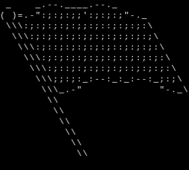

Flag - A Bash script for parsing command line flags
===================================================

Description:
-------
Flag is a Bash script that makes it easy to parse command line flags in
your Bash scripts. It uses the \`getopts\` Bash built-in command to
parse flags and convert them to easy-to-use variables in your script.

What does it stand for?:
-------
Flags stands for "Friendly Linux Argument Gatherer" or, if you like recursion, "Flags: Linux Argument Gatherer."

Usage
-----

To use \`flag\` in your Bash scripts, first source the script:

    source /path/to/flag.sh

Then, call the \`flag\` function and pass a string of valid flag
options, like this:

    flag "$@"

The function takes one argument which is a string of valid flag options.
Lowercase flag represent flag that don\'t take a value and uppercase
flag represent flag that take a value. The variables set will be
\`flag\_\[flag\]\`, for example \`flag\_a\` for flag \`-a\`.

License
-------

Flag is licensed under the MIT License. See the LICENSE file for
details.

Author
------

Flag was created by Amosnimos.
